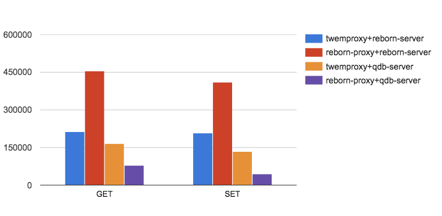
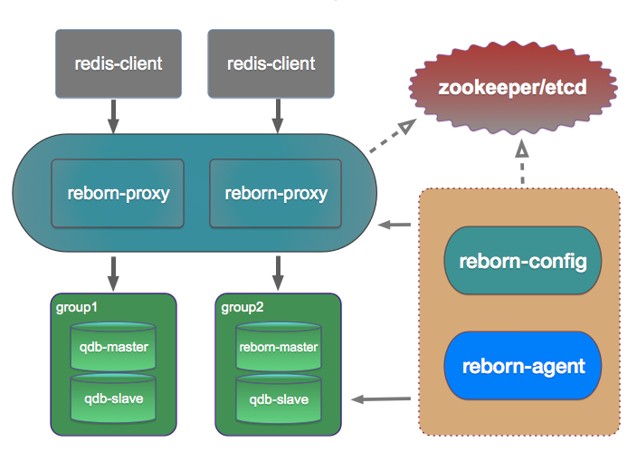
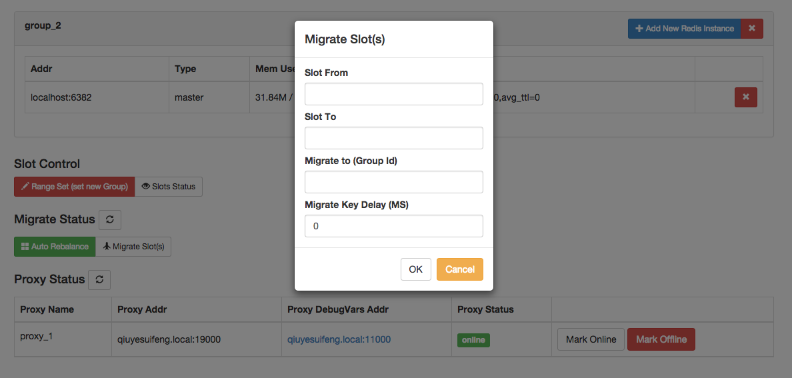

#Reborn - yet another fast distributed solution for Redis

Reborn is a proxy based high performance Redis cluster solution written in Go/C, an alternative to Twemproxy.

Reborn supports multiple stateless proxy with multiple redis instances.

Reborn is engineered to elastically scale, Easily add or remove redis or proxy instances on-demand/dynamicly.

##Features
* Auto rebalance
* Extremely simple to use 
* Support both redis or rocksdb transparently
* GUI dashboard & admin tools 
* Supports most of Redis commands, Fully compatible with twemproxy(https://github.com/twitter/twemproxy)
* Native Redis clients are supported
* Safe and transparent data migration, Easily add or remove nodes on-demand.
* Command-line interface is also provided
* RESTful APIs

## Build and Install

* Install go(we recommend go1.3.3, go1.4 has some performance issue) & ZooKeeper
* go get github.com/reborndb/reborn
* cd reborn
* ./bootstrap.sh
* make gotest
* cd sample
* follow instructions in usage.md

## Tutorial

[简体中文](https://github.com/reborndb/reborn/blob/master/doc/tutorial_zh.md)  
[English](https://github.com/reborndb/reborn/blob/master/doc/tutorial_en.md)

## FAQ

[简体中文](https://github.com/reborndb/reborn/blob/master/doc/FAQ_zh.md) 
[English (WIP) ](https://github.com/reborndb/reborn/blob/master/doc/FAQ_en.md)

## Performance (Benchmark)
Intel(R) Core(TM) i7-4770 CPU @ 3.40GHz

MemTotal: 16376596 kB

Twemproxy:  
  redis-benchmark -p 22121 -c 500 -n 5000000 -P 100 -r 10000 -t get,set
  
Reborn:  
  redis-benchmark -p 19000 -c 500 -n 5000000 -P 100 -r 10000 -t get,set

Result:  

  

[简体中文](https://github.com/reborndb/reborn/blob/master/doc/benchmark_zh.md)  
English (WIP)

## For Java users who want to support HA

[Jodis \(HA Reborn Connection Pool based on Jedis\)] (https://github.com/reborndb/reborn/tree/master/extern/jodis)

## Architecture

## Snapshots

Dashboard

Migrate

Slots

## Authors

* [@goroutine](https://github.com/ngaut)
* [@c4pt0r](https://github.com/c4pt0r)
* [@spinlock9](https://github.com/spinlock)

Thanks:

* [@ivanzhaowy](https://github.com/ivanzhaowy)
* [@Apache9](https://github.com/apache9)

## License

Reborn is licensed under MIT， see MIT-LICENSE.txt

-------------
*You are welcome to use Reborn in your product, and feel free to let us know~ :)*
